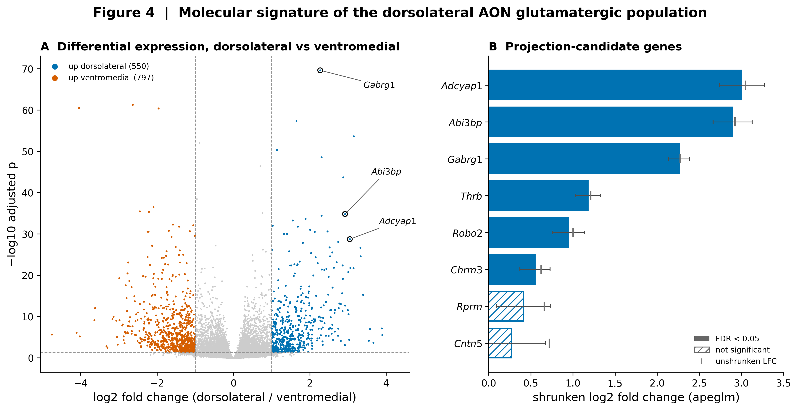
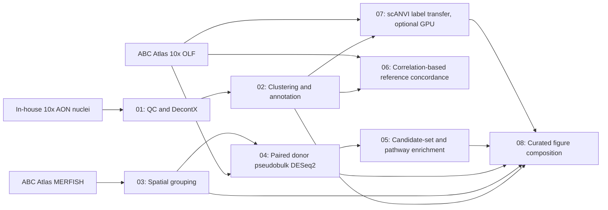
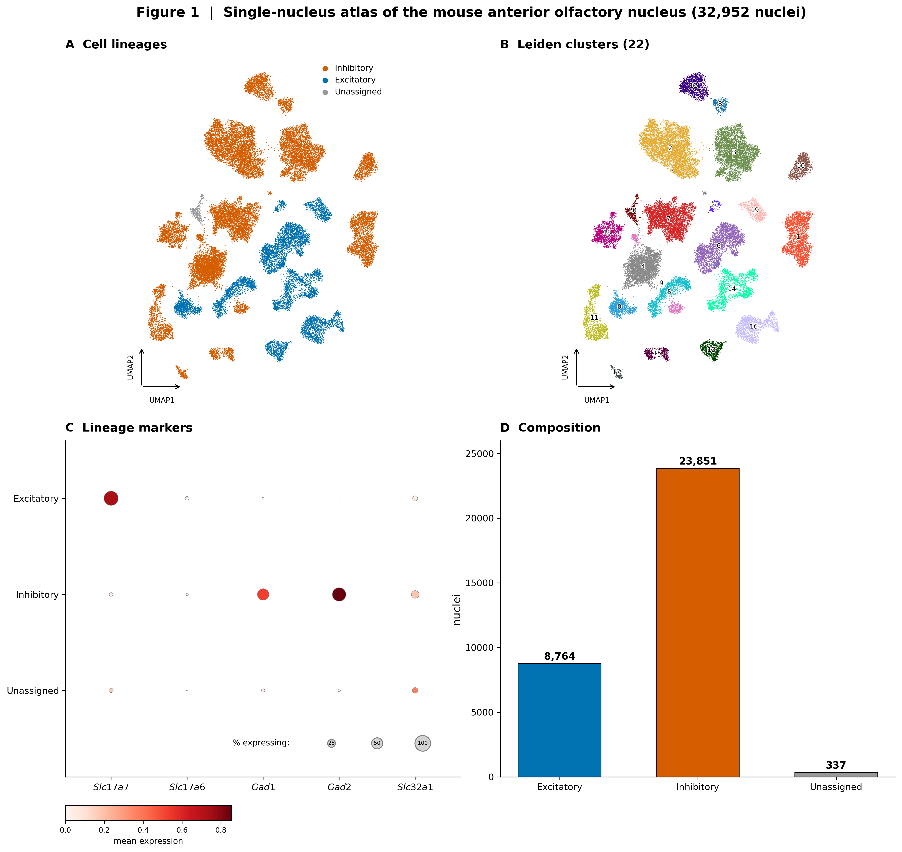
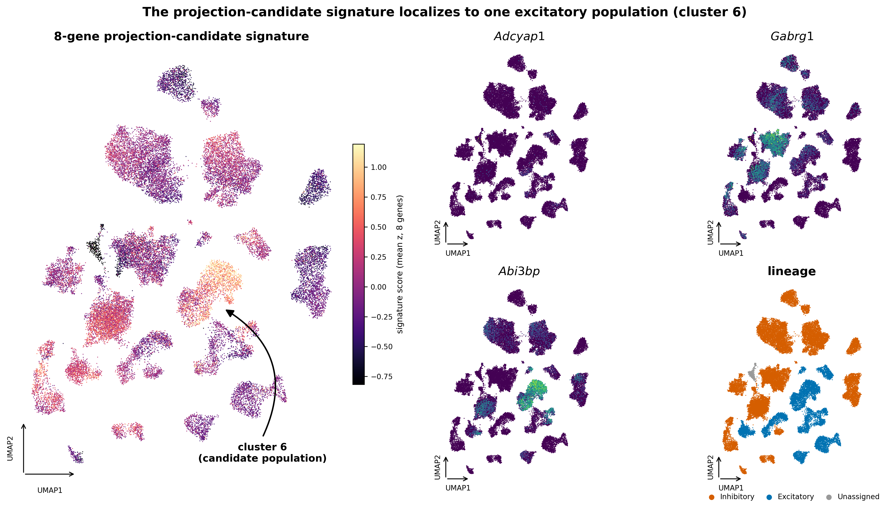
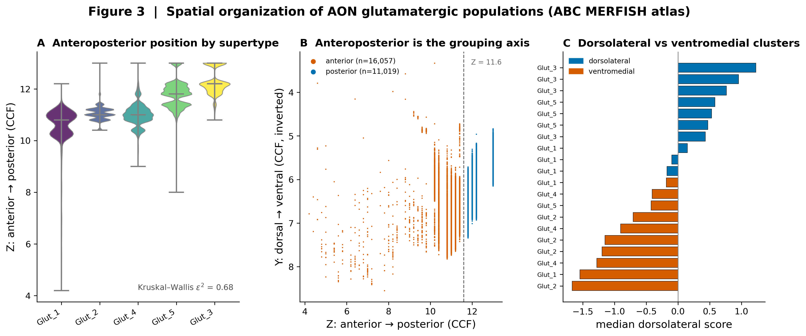
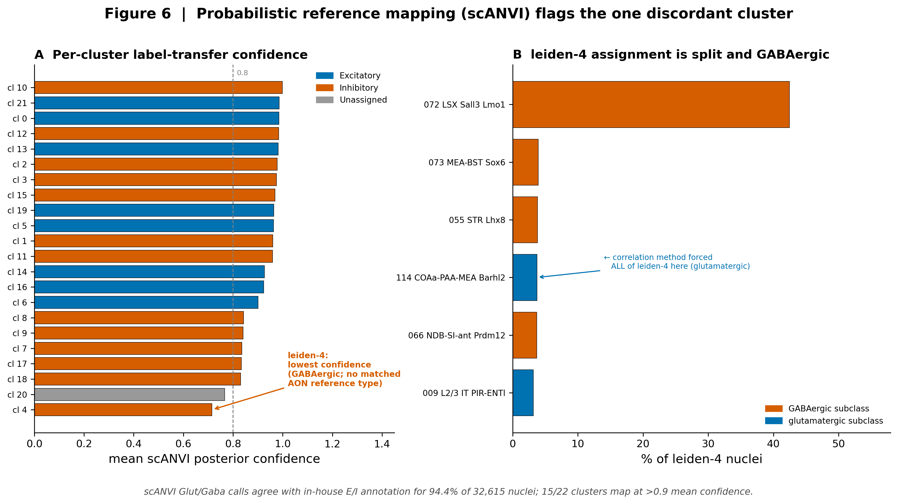

# Molecular Characterization of the Mouse Anterior Olfactory Nucleus

[](https://github.com/tisyasharma/AON_SnRNASeq_TS/actions/workflows/ci.yml)
[](LICENSE)

A reproducible single-nucleus RNA-seq workflow that integrates one in-house 10x AON library with the Allen Brain Cell Atlas to characterize AON cell populations and test a predefined marker signature for a dorsolateral glutamatergic population.

**Interpretation boundary:** projection status is not measured in these transcriptomic datasets. Dorsolateral position is used as a spatial proxy motivated by prior tracing work, not as a direct label for contralaterally projecting neurons.

## Results at a glance

| Analysis | Dataset | Main outcome |
|---|---|---|
| In-house cell atlas | One mouse AON hemisphere | 32,952 nuclei, 22 Leiden clusters, 8 excitatory clusters, 13 inhibitory clusters, and 1 unassigned cluster |
| Spatial mapping | ABC Atlas MERFISH | Anteroposterior position is the dominant molecular axis; dorsolateral position is a weaker, projection-relevant proxy |
| Differential expression | ABC Atlas 10x OLF cohort, 10 paired donors | 1,347 genes at FDR < 0.05 and \|log2FC\| > 1 in the dorsolateral versus ventromedial contrast |
| Candidate-marker test | Eight predefined genes | All eight have positive dorsolateral effect estimates; six pass FDR < 0.05 and five pass both the FDR and effect-size thresholds |
| Reference concordance | 171,284 labelled ABC Atlas reference cells before subclass-size filtering | Neurotransmitter-class agreement for 19 of 21 neuronal clusters, representing 88% of neuronal nuclei |

<p align="center">
  
  <br>
  <em>Paired donor-level pseudobulk differential expression identifies a dorsolateral molecular signature and evaluates the predefined eight-gene candidate panel.</em>
</p>

The complete main and supplementary figure set is available in [`results/figures_final/`](results/figures_final/), with machine-readable result tables in [`results/tables/`](results/tables/).

## Research question

The anterior olfactory nucleus coordinates bilateral olfactory processing, but the molecular identity of its contralaterally projecting glutamatergic population is not well resolved. Prior tracing work motivates a dorsolateral anatomical focus. This project asks:

1. Which neuronal populations are present in an in-house AON single-nucleus library?
2. Where do AON glutamatergic transcriptomic populations lie in the Allen Brain Cell Atlas spatial reference?
3. Does a predefined eight-gene candidate panel show a consistent dorsolateral molecular signature?
4. How well do the in-house annotations agree with an independent whole-brain reference?

The analysis keeps three concepts separate throughout:

- **In-house clustering and annotation** are descriptive results from one mouse.
- **Atlas differential expression** uses donor-level replication across ten paired donors.
- **Dorsolateral identity** is a spatial proxy and is not presented as a measured projection phenotype.

## Analytical design



## Key findings

### 1. A cellular atlas from the in-house AON library

After quality control and Scrublet doublet removal, 32,952 nuclei resolve into 22 Leiden clusters at a silhouette-selected resolution of 0.1. Marker-fraction annotation identifies 8 excitatory and 13 inhibitory clusters. One 337-nucleus cluster does not meet the annotation threshold and remains unassigned rather than being force-labelled.

<p align="center">
  
  <br>
  <em>Cellular atlas of 32,952 QC-filtered AON nuclei.</em>
</p>

Within this single-mouse dataset, the predefined eight-gene candidate signature is strongest in excitatory cluster 6. This is an in-house candidate-population readout, not evidence that the cluster's projection target has been directly measured.

<p align="center">
  
  <br>
  <em>The eight-gene candidate signature localizes to a single excitatory population (cluster 6).</em>
</p>

### 2. Two spatial axes with different interpretations

ABC Atlas MERFISH coordinates are used to locate five AON glutamatergic supertypes across 20 clusters.

- **Anteroposterior** is the dominant molecular axis, with epsilon-squared 0.73 and AUROC 0.96.
- **Dorsolateral versus ventromedial** is the projection-relevant proxy, with epsilon-squared 0.32 and AUROC 0.80.

The weaker dorsolateral axis is retained because it addresses the biological hypothesis. The stronger anteroposterior axis is reported as a robustness analysis rather than substituted for the primary question.

<p align="center">
  
  <br>
  <em>Spatial organization of AON glutamatergic supertypes: anteroposterior is the dominant molecular axis, dorsolateral versus ventromedial the projection-relevant proxy.</em>
</p>

### 3. Donor-level differential expression avoids pseudoreplication

Differential expression is performed on raw ABC Atlas 10x counts after aggregation by donor and spatial group. The paired design, `~ donor + group`, uses the ten donors that contribute sufficient cells to both groups.

At FDR < 0.05 and \|log2FC\| > 1, the analysis identifies:

- **1,347 differential genes**
- **550 genes higher in dorsolateral cells**
- **797 genes higher in ventromedial cells**
- **5 of 8 candidate genes** passing both thresholds
- **6 of 8 candidate genes** passing FDR < 0.05
- **Fisher odds ratio 21.9** for over-representation of the candidate panel among thresholded dorsolateral hits

All eight candidate genes have positive dorsolateral effect estimates. Only `Adcyap1` is treated as having direct primary-literature support in the AON; the remaining genes are reported with explicit evidence tiers or caveats.

### 4. Independent reference checks expose disagreement instead of hiding it

Correlation-based label transfer agrees with the in-house excitatory or inhibitory call for 19 of 21 neuronal clusters. The largest disagreement is concentrated in a GABAergic cluster whose best whole-transcriptome correlation is an unmatched glutamatergic reference subclass. Marker expression and anatomical context support retaining the in-house inhibitory call.

A supplementary scANVI analysis records per-cell posterior confidence and shows that the major discordant cluster maps heterogeneously and with lower confidence than most clusters.

<p align="center">
  
  <br>
  <em>Probabilistic reference mapping reveals the lower-confidence, heterogeneous mapping of the major discordant cluster.</em>
</p>

## Repository structure

```text
.
├── .github/workflows/ci.yml        # lint, configuration checks, and Snakemake dry-run
├── config/config.yaml              # analysis thresholds and repository-relative paths
├── docs/METHODS.md                 # complete methodology, statistical design, and limitations
├── notebooks/
│   ├── 01_preprocessing.ipynb
│   ├── 02_clustering.ipynb
│   ├── 03_abca_spatial.ipynb
│   ├── 04_differential_expression.ipynb
│   ├── 05_enrichment.ipynb
│   ├── 06_reference_concordance.ipynb
│   ├── 07_scanvi_label_transfer.ipynb
│   ├── 08_figure_composition.py
│   └── plotting_style.py
├── results/
│   ├── figures_final/              # curated main and supplementary figures
│   ├── figures_raw/                # notebook-level diagnostic plots
│   └── tables/                     # machine-readable analysis outputs
├── workflow/scripts/
│   └── deseq2_crosscheck.R         # independent R/Bioconductor refit
├── CITATION.cff
├── Dockerfile
├── environment.yml
└── Snakefile
```

## Pipeline stages

| Stage | File | Purpose |
|---|---|---|
| 01 | [`notebooks/01_preprocessing.ipynb`](notebooks/01_preprocessing.ipynb) | QC, gene filtering, preliminary clustering, DecontX ambient-RNA correction, and checkpoint creation |
| 02 | [`notebooks/02_clustering.ipynb`](notebooks/02_clustering.ipynb) | Scrublet doublet scoring, normalization, HVG selection, PCA, neighbour graphs, Leiden selection, lineage annotation, and in-house candidate scoring |
| 03 | [`notebooks/03_abca_spatial.ipynb`](notebooks/03_abca_spatial.ipynb) | MERFISH-based anteroposterior and dorsolateral spatial assignments |
| 04 | [`notebooks/04_differential_expression.ipynb`](notebooks/04_differential_expression.ipynb) | Paired donor-level pseudobulk DESeq2, candidate evaluation, diagnostics, and robustness analyses |
| 05 | [`notebooks/05_enrichment.ipynb`](notebooks/05_enrichment.ipynb) | Candidate-set over-representation and supporting pathway enrichment |
| 06 | [`notebooks/06_reference_concordance.ipynb`](notebooks/06_reference_concordance.ipynb) | Correlation-based transfer of ABC Atlas reference labels to in-house clusters |
| 07 | [`notebooks/07_scanvi_label_transfer.ipynb`](notebooks/07_scanvi_label_transfer.ipynb) | Optional GPU-based probabilistic label transfer; outside the Snakemake DAG |
| 08 | [`notebooks/08_figure_composition.py`](notebooks/08_figure_composition.py) | Builds the six main figures, two standalone UMAPs, and supplementary Figures S1–S2 from analysis outputs |

## Reproducing the analysis

### 1. Create the environment

The repository provides a **version-constrained** Conda environment. Most dependencies use minimum-version constraints; `abc_atlas_access` is pinned to a specific commit.

```bash
conda env create -f environment.yml
conda activate aon-snrnaseq
```

### 2. Provide the input data

Paths are centralized in [`config/config.yaml`](config/config.yaml).

| Input | Expected path | Availability |
|---|---|---|
| In-house 10x filtered matrix | `data/aon_10x/filtered_feature_bc_matrix.h5` | Not committed; required for preprocessing and clustering |
| Candidate-gene table | `data/aon_10x/Candidate_Genes.csv` | Committed with the repository |
| ABC 10x cell metadata | `data/allen_brain_atlas/10x_cell_metadata_with_group_membership.csv` | Public ABC Atlas release `20230630` |
| ABC MERFISH cell metadata | `data/allen_brain_atlas/merfish_cell_metadata_with_group_membership.csv` | Public ABC Atlas release `20230630` |
| ABC OLF raw counts | Path defined by `allen_raw_matrix` in `config/config.yaml` | Public ABC Atlas release `20230630` |
| ABC OLF log2 matrix | `data/allen_brain_atlas/WMB-10Xv2-OLF-log2.h5ad` | Public ABC Atlas release `20230630` |
| Integrated scANVI query/reference object | `data/aon_10x/scanvi_input.h5ad` | Required only for stage 07; not generated by the Snakemake DAG |

Large `.h5`, `.h5ad`, and `.rds` files are intentionally excluded from Git.

The public ABC Atlas files (metadata and the `WMB-10Xv2-OLF` matrices, release `20230630`) are downloaded with the pinned [`abc_atlas_access`](https://github.com/AllenInstitute/abc_atlas_access) package into `data/allen_brain_atlas/`. A scripted downloader for one-command setup is a planned addition.

### 3. Validate and run the core DAG

```bash
snakemake -n --cores 1 all
snakemake --cores 4 all
```

The core DAG executes stages 01 through 06 plus the independent R DESeq2 cross-check. The DecontX preprocessing stage is the longest stage in the current workflow.

To run only the public-data analysis after the ABC Atlas files are available at the configured paths:

```bash
snakemake --cores 4 abca_spatial de enrich crosscheck
```

### 4. Run the optional GPU label transfer

Stage 07 is intentionally outside the DAG because it requires a GPU-capable scvi-tools environment.

```bash
jupyter nbconvert \
  --to notebook \
  --execute \
  --inplace \
  --ExecutePreprocessor.timeout=-1 \
  notebooks/07_scanvi_label_transfer.ipynb
```

### 5. Rebuild the curated figures

The final composed figures are generated separately from the core Snakemake DAG:

```bash
python notebooks/08_figure_composition.py
```

This builds the six main figures, the two standalone UMAPs, and supplementary Figures S1–S2 (S3–S7 are per-notebook outputs, not produced here). It requires the relevant intermediate objects and result tables, including the in-house preprocessed AnnData object for figures that display the in-house atlas.

### Container execution

```bash
docker build -t aon-snrnaseq .
docker run --rm -it -v "$PWD:/work" aon-snrnaseq snakemake --cores 4 all
```

The Docker build provides environment parity but is not currently exercised by CI.

## Continuous integration

The GitHub Actions workflow performs fast structural checks rather than rerunning the full biological analysis. It:

- runs Ruff across Python and notebook sources;
- validates `config/config.yaml` and `environment.yml`;
- checks that core workflow files are tracked; and
- performs a Snakemake dry-run with placeholder inputs.

A passing badge therefore indicates that the repository structure and DAG resolve successfully. It does not certify that the full data-intensive pipeline or Docker image has been executed in CI.

## Data and output availability

- **Public reference data:** Allen Brain Cell Atlas MERFISH and 10x Whole Mouse Brain release `20230630`.
- **In-house library:** the raw 10x matrix is not committed. Public deposition to GEO/SRA is pending.
- **Committed outputs:** result tables, raw diagnostic figures, and curated final figures are available under [`results/`](results/).
- **Regenerable intermediates:** large AnnData, HDF5, and R objects are excluded from version control.

## Limitations

1. The in-house atlas is based on one mouse hemisphere and has no in-house biological replication.
2. Dorsolateral position is a spatial proxy for the projection hypothesis, not a measured projection phenotype.
3. The anteroposterior axis is molecularly stronger than the dorsolateral axis.
4. DecontX reached its configured iteration limit before satisfying its convergence criterion; contamination estimates are treated as diagnostic rather than definitive.
5. Atlas differential expression is limited to ten paired donors from one 10x chemistry.
6. Most candidate genes were predefined hypotheses rather than independently established AON projection markers.

See [`docs/METHODS.md`](docs/METHODS.md) for the full methodology, robustness analyses, evidence boundaries, and references.

## Citation and license

Citation metadata are provided in [`CITATION.cff`](CITATION.cff). The code is released under the [`MIT License`](LICENSE).

**Maintainer:** [Tisya Sharma](https://github.com/tisyasharma)
